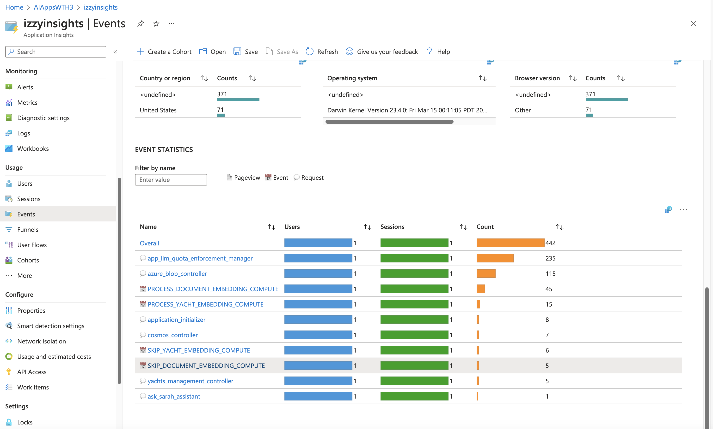
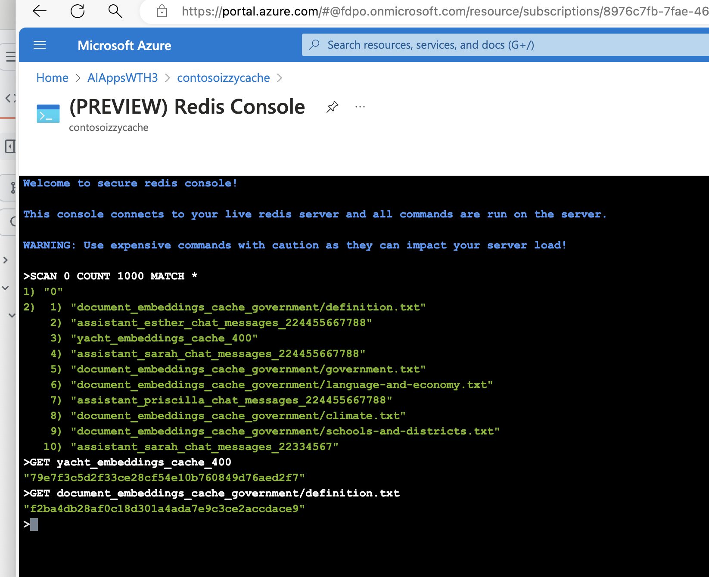

# Challenge 05 - Performance and Cost and Optimizations

[< Previous Challenge](./Challenge-04.md) - **[Home](../README.md)** 

## Pre-requisites (Optional)

This challenge assumes that all requirements for Challenges 01, 02, 03 and 04 were successfully completed.

## Introduction

Calculating embeddings costs money and we do not have to pay for the embedding computation if nothing has changed in the documents. Depending on the embedding service and the amount of documents as well as the frequency of the event triggers there have been customers/partners that have spent hundreds of thousands of dollars recomputing embeddings for documents that did not change.

The goal of this challenge is to ensure that expensive calls such as computing the embedding vectors for the documents are only performed if necessary.

When non-text fields for yachts such as pricing and capacity are modified, we should not have to update the embedding vectors for the description field. The expensive embedding calls to OpenAI should only be made when the text fields such as description have been updated. Similarly, if we simply re-upload the Contoso Islands government files to blob store without making any changes the embedding calls should also be skipped when these uploads trigger the Azure functions.

The embedding calls are only necessary when the description field for the yacht is updated or when the text contents in these government files are modified and the files are re-uploaded.

To simplify the tracking of these events we have set up the following 4 events in Azure Monitor using Azure Application Insights custom events

- **`PROCESS_DOCUMENT_EMBEDDING_COMPUTE`** - the embedding was computed for the document upload to Blob Store
- **`PROCESS_YACHT_EMBEDDING_COMPUTE`** - the embedding was computed for the yacht upload to Cosmos DB
- **`SKIP_DOCUMENT_EMBEDDING_COMPUTE`** - the embedding was NOT computed for the document upload to Blob Store
- **`SKIP_YACHT_EMBEDDING_COMPUTE`** - this means the the embedding was NOT computed for the yacht upload to Cosmos DB

When the **`COMPUTE_EMBEDDINGS_ONLY_IF_NECESSARY`** setting in the application config is set to **`0`** all embeddings are processed regardless of whether there are any changes in the text field of the record.

When the **`COMPUTE_EMBEDDINGS_ONLY_IF_NECESSARY`** setting in the application config is set to **`1`**, embeddings are only processed if there are any changes in the text field of the record.

## Description

In this challenge, we will do the following:

- When the application needs to enforce cost management, we ensure that documents are only processed for embeddings if their textual contents have been updated.
- Ensure that we are not processing the embeddings for the Yachts if the description of the Yacht has not been modified


## Challenge Verification

To kick things off, ensure that the **`COMPUTE_EMBEDDINGS_ONLY_IF_NECESSARY`** application setting in your `local.settings.json` file is set to `0`

When this value is set to `0`, embeddings are computed regardless of whether the text contents have been modified.
When it is set to `1`, embeddings are only calculated if the text contents have been updated.

The application solves this by maintaining a copy of the document or description contents' SHA1 HASH in memory via Azure Redis Cache and comparing it to subsequent receipts of similar content for the same record or document to ensure that we only compute the embedding if the text contents have been modified.

Using the HTTP client, make changes to each yacht `price` and `maxCapacity` fields and save the changes.
Using the file uploader, re-upload all the files to the government blob container AS IS without making any changes.

In app insights, you should see the following events registered for each document filename and yacht id you have modified respectively:
- **`PROCESS_DOCUMENT_EMBEDDING_COMPUTE`**
- **`PROCESS_YACHT_EMBEDDING_COMPUTE`**

After this has been verified, update the value of the **`COMPUTE_EMBEDDINGS_ONLY_IF_NECESSARY`** application setting and set to 1

Using the HTTP client, make changes to each yacht `price` and `maxCapacity` fields and save the changes.
Using the file uploader, re-upload all the files to the government blob container AS IS without making any changes.

Please note that it may take up to 5 minutes for your custom log events from the app to show up in Azure Application Insights.



In app insights, you should see the following events registered for each document and yacht you have modified respectively:
- **`SKIP_YACHT_EMBEDDING_COMPUTE`**
- **`SKIP_DOCUMENT_EMBEDDING_COMPUTE`**

This means that the embedding was only computed if the yacht description or text content of the documents were modified.

Using the HTTP client, make changes to each yacht description fields and save the changes.
Using the file uploader, re-upload all the files to the government blob container with minor punctuation (commas, paragraphs, periods) and save the changes and re-upload.

In App Insights, you should see the following events registered for each document and yacht you have modified respectively:
- **`PROCESS_DOCUMENT_EMBEDDING_COMPUTE`**
- **`PROCESS_YACHT_EMBEDDING_COMPUTE`**

For each of the modification attempts, you should also be able to see the hashes in the Redis Cache for the corresponding document and yacht

````bash

# Run this to see all the keys in the Cache
SCAN 0 COUNT 1000 MATCH *

# Run this for each key to retrieve the value
GET {key}
GET yacht_embeddings_cache_400
GET document_embeddings_cache_government/definition.txt

````



## Success Criteria

A successfully completed solution should accomplish the following goals:

- Ensure that for the updates to the Yachts, if only the pricing or capacity details are updated no embedding should be processed.
- Ensure that for documents, the embeddings are only computed if the text contents were modified.


## Learning Resources

- [Redis Strings](https://redis.io/docs/data-types/strings/)
- [Redis lists](https://redis.io/docs/data-types/lists/)

## Tips
- Compute the MD5 or SHA1 hash of the document description
- Store the hash in Redis
